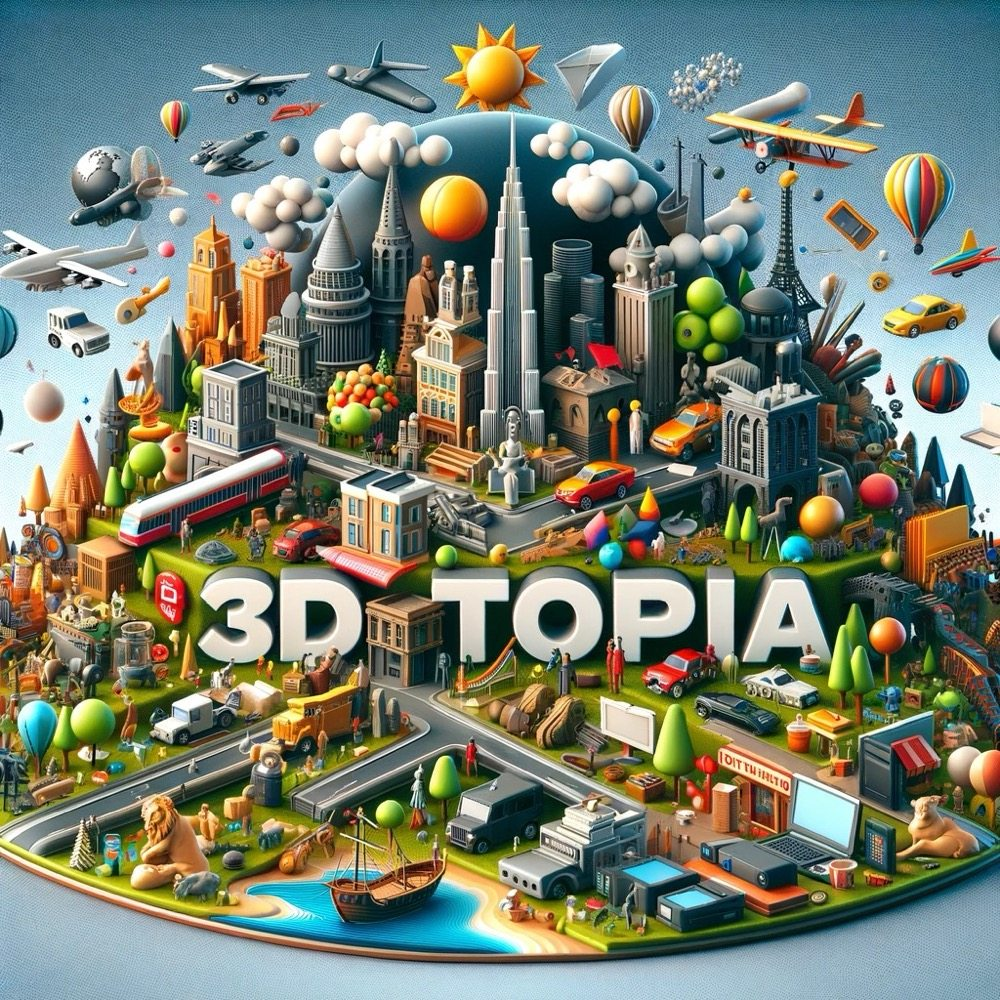

<p align="center">
    <picture>
    
    </picture>
</p>

<div align="center">
  <h1>3DTopia</h1>
  <p>
      A two-stage text-to-3D generation model. The first stage uses diffusion model to quickly generate candidates. The second stage refines the assets chosen from the first stage.
  </p>
  

  <p>
       
  </p>

https://github.com/3DTopia/3DTopia/assets/23376858/c9716cf0-6e61-4983-82b2-2e8f579bd46c
    
</div>

## News

[2024/03/10] Our captions for Objaverse is released [here](https://github.com/3DTopia/3DTopia/releases).

[2024/03/04] Our technical report is released [here](https://arxiv.org/pdf/2403.02234.pdf).

[2024/01/18] We release a text-to-3D model 3DTopia!

## Citation
```
@article{hong20243dtopia,
  title={3DTopia: Large Text-to-3D Generation Model with Hybrid Diffusion Priors},
  author={Hong, Fangzhou and Tang, Jiaxiang and Cao, Ziang and Shi, Min and Wu, Tong and Chen, Zhaoxi and Wang, Tengfei and Pan, Liang and Lin, Dahua and Liu, Ziwei},
  journal={arXiv preprint arXiv:2403.02234},
  year={2024}
}
```

## 1. Quick Start

### 1.1 Install Environment for this Repository
We recommend using Anaconda to manage the environment.
```bash
conda env create -f environment.yml
```

### 1.2 Install Second Stage Refiner
Please refer to [threefiner](https://github.com/3DTopia/threefiner) to install our second stage mesh refiner. We have tested installing both environments together with Pytorch 1.12.0 and CUDA 11.3.

### 1.3 Download Checkpoints \[Optional\]
We have implemented automatic checkpoint download for both `gradio_demo.py` and `sample_stage1.py`. If you prefer to download manually, you may download checkpoint `3dtopia_diffusion_state_dict.ckpt` or `model.safetensors` from [huggingface](https://huggingface.co/hongfz16/3DTopia).

### Q&A
- If you encounter this error in the second stage `ImportError: /lib64/libc.so.6: version 'GLIBC_2.25' not found`, try to install a lower version of pymeshlab by `pip install pymeshlab==0.2`.

## 2. Inference

### 2.1 First Stage
Run the following command to sample `a robot` as the first stage. Results will be located under the folder `results`.
```bash
python -u sample_stage1.py --text "a robot" --samples 1 --sampler ddim --steps 200 --cfg_scale 7.5 --seed 0
```

Arguments:
- `--ckpt` specifies checkpoint file path;
- `--test_folder` controls which subfolder to put all the results;
- `--seed` will fix random seeds; `--sampler` can be set to `ddim` for DDIM sampling (By default, we use 1000 steps DDPM sampling);
- `--steps` controls sampling steps only for DDIM;
- `--samples` controls number of samples;
- `--text` is the input text;
- `--no_video` and `--no_mcubes` suppress rendering multi-view videos and marching cubes, which are by-default enabled;
- `--mcubes_res` controls the resolution of the 3D volumn sampled for marching cubes; One can lower this resolution to save graphics memory;
- `--render_res` controls the resolution of the rendered video;

### 2.2 Second Stage
There are two steps as the second stage refinement. Here is a simple example. Please refer to [threefiner](https://github.com/3DTopia/threefiner) for more detailed usage.
```bash
# step 1
threefiner sd --mesh results/default/stage1/a_robot_0_0.ply --prompt "a robot" --text_dir --front_dir='-y' --outdir results/default/stage2/ --save a_robot_0_0_sd.glb
# step 2
threefiner if2 --mesh results/default/stage2/a_robot_0_0_sd.glb --prompt "a robot" --outdir results/default/stage2/ --save a_robot_0_0_if2.glb
```
The resulting mesh can be found at `results/default/stage2/a_robot_0_0_if2.glb`

## 3. Acknowledgement
We thank the community for building and open-sourcing the foundation of this work. Specifically, we want to thank [EG3D](https://github.com/NVlabs/eg3d), [Stable Diffusion](https://github.com/CompVis/stable-diffusion) for their codes. We also want to thank [Objaverse](https://objaverse.allenai.org) for the wonderful dataset.
